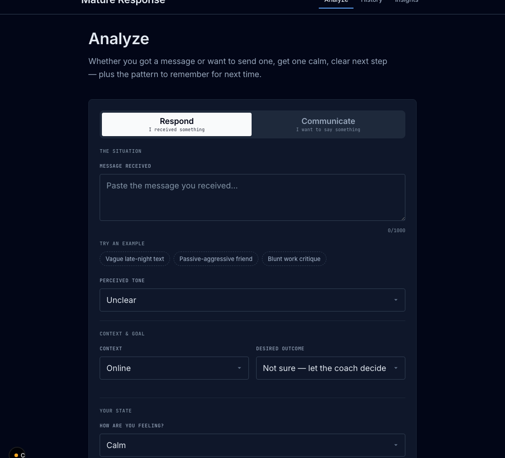
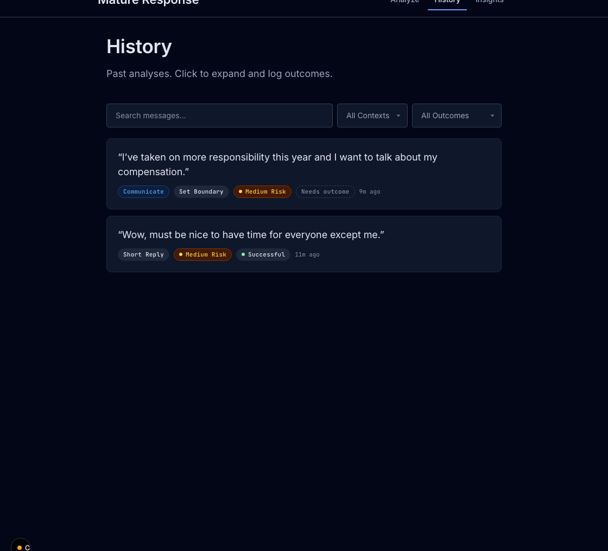
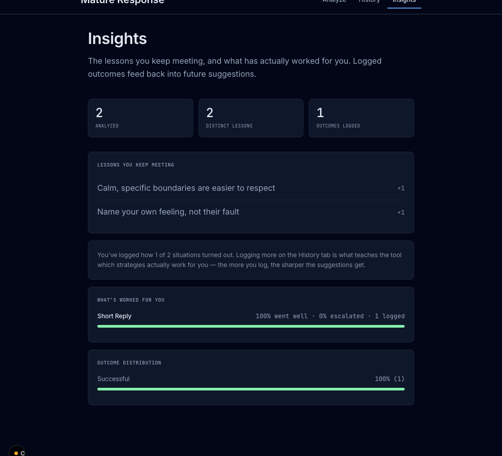

# Mature Response

A communication coach that runs entirely on your own machine. It helps you decide whether and how to reply to a message, or how to word something you need to say, and it names the pattern behind each situation so the judgment gradually becomes yours.

The reasoning runs in a local model through [Ollama](https://ollama.com). History is a local SQLite file. There is no account, no API key, and nothing leaves the computer.

> **Status:** a finished personal project, shared as-is. Not actively maintained — issues and pull requests may not get a response. Fork it freely.

<!--
Screenshots: capture the Analyze, History, and Insights views and save them as
docs/analyze.png, docs/history.png, docs/insights.png — then uncomment this block.

## Screenshots

| Analyze | History | Insights |
| --- | --- | --- |
|  |  |  |
-->

## What it does

It works in two modes.

**Respond** takes a message you received and returns one recommended action — ignore, wait, short reply, clarify, set a boundary, or have a direct conversation — along with a draft reply when one is warranted.

**Communicate** takes something you want to say and returns a draft worded toward the outcome you choose, structured the way a counselor would frame it.

Every result also carries a confidence score, a risk level, the likely intent behind the message (read separately from its tone), the reason the action fits, and a one-line coaching insight: the transferable lesson, not just the move.

## How it is built

The model proposes; the code decides. A small local model is treated as a fallible drafter. Its output is parsed defensively, its self-reported confidence is thrown away and recomputed from observable signals (message length, tone clarity, missing context), and a set of rules is applied afterward that the model cannot talk its way out of:

- a clearly constructive message is not allowed to read as high risk;
- vague or empty input returns *clarify* rather than an invented answer;
- a self-rated intensity of eight or higher forces a pause before anything is sent.

When you record how a situation turned out, that outcome is folded into the next analysis, so the advice leans toward what has actually worked for you instead of a generic default. The Insights tab shows the same data plainly: the lessons that keep recurring, and which strategies have defused situations versus escalated them.

The drafting follows established practice — Nonviolent Communication for expressing a need, DBT's DEAR MAN for boundaries, and the cool-off rule from Gottman's research on conflict. The interface follows the usual usability laws: a grouped form, large targets, immediate feedback, one clear focal point per screen. One-tap examples seed a realistic situation so the first screen is never blank; ⌘/Ctrl+Enter sends; and History shows each entry's logged outcome at a glance, with a filter for the ones still waiting on one.

## Running it

Install three things once: [Node.js](https://nodejs.org) (LTS), [Ollama](https://ollama.com), and at least one chat model:

```bash
ollama pull llama3:8b
```

Then start it:

```bash
npm install
npm run dev          # http://localhost:3000
```

On macOS you can instead double-click `start.command`; on Windows, `start.bat`. Either one installs, builds, starts the server, and opens the browser. Step-by-step notes are in [SETUP.md](SETUP.md).

Any model you have pulled shows up in the Model menu automatically. Larger models read nuance better but need more memory; `llama3:8b` is a safe default.

## Project layout

```
app/            pages (Analyze, History, Insights) and API routes
components/      the UI
lib/
  ai/           prompts, transport, parsing, and the rules that hold judgment
  db.js         SQLite: entries, insights, outcome history
  constants.js  modes, desired outcomes, the lesson taxonomy
public/fonts/    self-hosted Inter and JetBrains Mono
```

## Privacy

Nothing is uploaded. The database lives in `data/`, which is excluded from version control, so a copy of the project carries no history — every install begins empty.

## Compatibility

Runs on macOS, Linux, and Windows, in any current browser (Chrome, Firefox, Safari, Edge). It is built for a desktop screen; the layout is a centered column with a fixed reading width, so on very wide displays it stays centered by design rather than stretching.

## License

[MIT](LICENSE).
